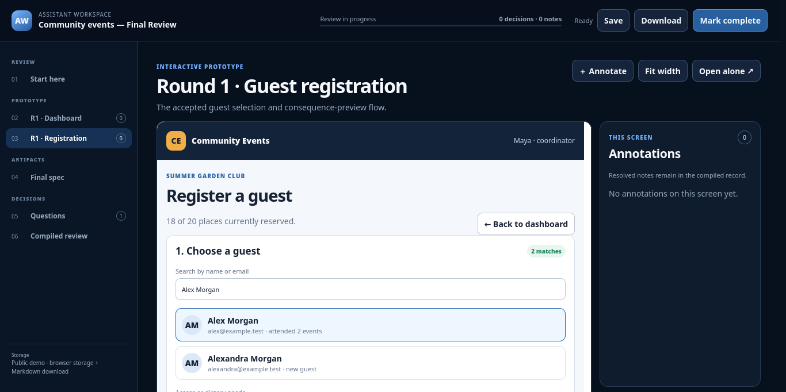
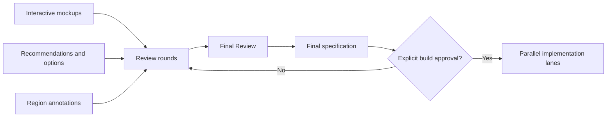

<div align="center">

# Assistant Workspace

### Turn interactive prototypes and human decisions into implementation-ready specifications.

**Dependency-free · Multi-round workspaces · Connected mockups · Final Review gates · Public demo mode**

</div>



Assistant Workspace gives humans and coding agents a durable place to conduct design reviews over several hours, days or rounds. Reviewers can exercise connected HTML prototypes, annotate exact regions, answer recommendations, revisit earlier work and compile the result into a Markdown handoff.

> [!IMPORTANT]
> Completing a review—or even a Final Review—never authorizes implementation. The assistant must ask separately before beginning the product build.

## Why it exists

Design conversations become fragile when mockups, questions and decisions are spread across chat messages and temporary files. Assistant Workspace keeps the full chain together:



## Highlights

| Capability | What it provides |
|---|---|
| Workspace history | Related rounds and older decisions remain easy to revisit. |
| Truly interactive mockups | Prototype buttons, filters, navigation and confirmations demonstrate the connected flow. |
| Annotation mode | Reviewers attach changes, questions or “keep this” notes to stable regions. |
| Decision support | Each question can contain a recommendation, alternatives, trade-offs and a free-form answer. |
| Durable handoff | Review state is compiled into Markdown instead of remaining trapped in browser UI. |
| Final Review validation | Every source mockup, source decision and final specification must be present before design closes. |
| Parallel-agent boundaries | Each agent can own a separate workspace or round without overwriting another agent's output. |
| Public/private split | The reusable engine can be public while sensitive review packs and reviewer state live elsewhere. |

## Try it

The repository includes a completely fictional Community Events workspace with a numbered round and a coverage-validated Final Review.

```bash
git clone git@github-personal:<your-user>/Assistant-Workspace.git
cd Assistant-Workspace
npm start
```

Open <http://127.0.0.1:8777/>.

Requirements: Node.js 22 or newer. There are no runtime packages, database migrations or frontend build dependencies.

## Public GitHub Pages demo

The repository can publish its fictional example to GitHub Pages on every push to `main`:

```bash
npm run build:demo
```

The Pages workflow validates the content, exports a static site and deploys `_site`. The public demo keeps answers and annotations in that browser and supports Markdown download; it does not provide server autosave or upload private review material.

After the repository is published, select **Settings → Pages → Source: GitHub Actions**. The resulting address will be:

```text
https://<personal-user>.github.io/Assistant-Workspace/
```

GitHub Pages sites are public. Only the bundled fictional example is exported.

## Commands

```bash
npm start              # local server with file autosave
npm test               # syntax and content-contract validation
npm run test:browser   # real Firefox interaction smoke test
npm run build:demo     # static GitHub Pages export
```

Runtime configuration:

```bash
REVIEW_PORT=9000 npm start
REVIEW_CONTENT_ROOT=/path/to/private/reviews npm start
REVIEW_DATA_ROOT=/path/to/private/state npm start
REVIEW_PROJECTS_ROOT=/path/to/projects npm start
```

For a persistent multi-project workstation, prefer `REVIEW_PROJECTS_ROOT`. One server then exposes every project and piece of work through URL paths rather than extra ports:

```text
/projects/atlas/groups/billing-workspace/
/projects/beacon/groups/field-operations/
/projects/harbour/groups/rollout-planning/
```

Create durable project and workspace folders with:

```bash
REVIEW_PROJECTS_ROOT=/path/to/projects npm run project:create -- beacon "Beacon"
REVIEW_PROJECTS_ROOT=/path/to/projects npm run workspace:create -- beacon field-operations "Field operations"
REVIEW_PROJECTS_ROOT=/path/to/projects npm run roadmap:create -- atlas billing-workspace final-review
```

## Content model

```text
reviews/
  example-workspace/
    workspace.json
    round-1/
      review.json
      mocks/
        dashboard.html
        registration.html
    final-review/
      review.json
      artifacts/
        final-spec.md
```

In multi-project mode, the same workspace structure sits under each project manifest’s `contentRoot`. See [Project namespaces](docs/projects.md).

Generated reviewer state is stored separately under `.review-data/<workspace>/<round>/` and ignored by Git.

Stable application paths:

```text
/                                      workspace library
/groups/<workspace>/                   workspace history
/groups/<workspace>/reviews/<round>/   one review round
```

## The Final Review rule

Every workspace ends with a distinct Final Review containing:

1. every accepted mockup from every source round;
2. every settled decision linked to its source question;
3. the generated final specification;
4. visible contradictions or requested corrections;
5. one final acceptance decision.

Validation fails if a source mockup or source decision disappears. Material changes create the next numbered round and a replacement Final Review.

Read the complete [Final Review contract](docs/final-review.md).

## Documentation

- [Concepts and boundaries](docs/concepts.md)
- [Authoring review packs](docs/authoring.md)
- [Interactive mockup contract](docs/interactive-mockups.md)
- [Agent collaboration workflow](docs/agents.md)
- [Project namespaces and shared daemon layout](docs/projects.md)
- [Reusable implementation roadmaps](docs/implementation-roadmaps.md)
- [Copy-ready Claude memory prompt](docs/claude-memory-prompt.md)
- [Hosted deployment](docs/hosting.md)
- [Personal/work GitHub account isolation](docs/multiple-github-accounts.md)
- [Security model](SECURITY.md)
- [Roadmap](docs/roadmap.md)
- [Publishing checklist](docs/publishing.md)

## Project status

The engine, grouped workspace navigation, static export, fictional example and browser smoke tests are working. Hosted authentication, agent uploads, concurrency control and private multi-user review are documented future work.

Released under the [MIT License](LICENSE). Copyright © 2026 AurorasChaos.
